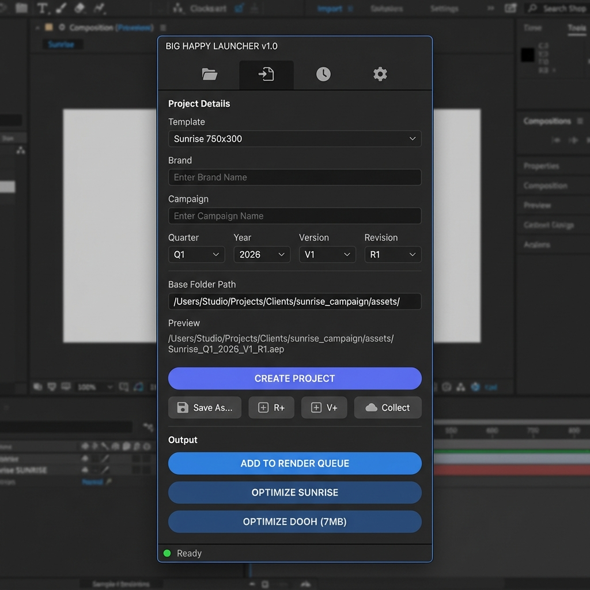
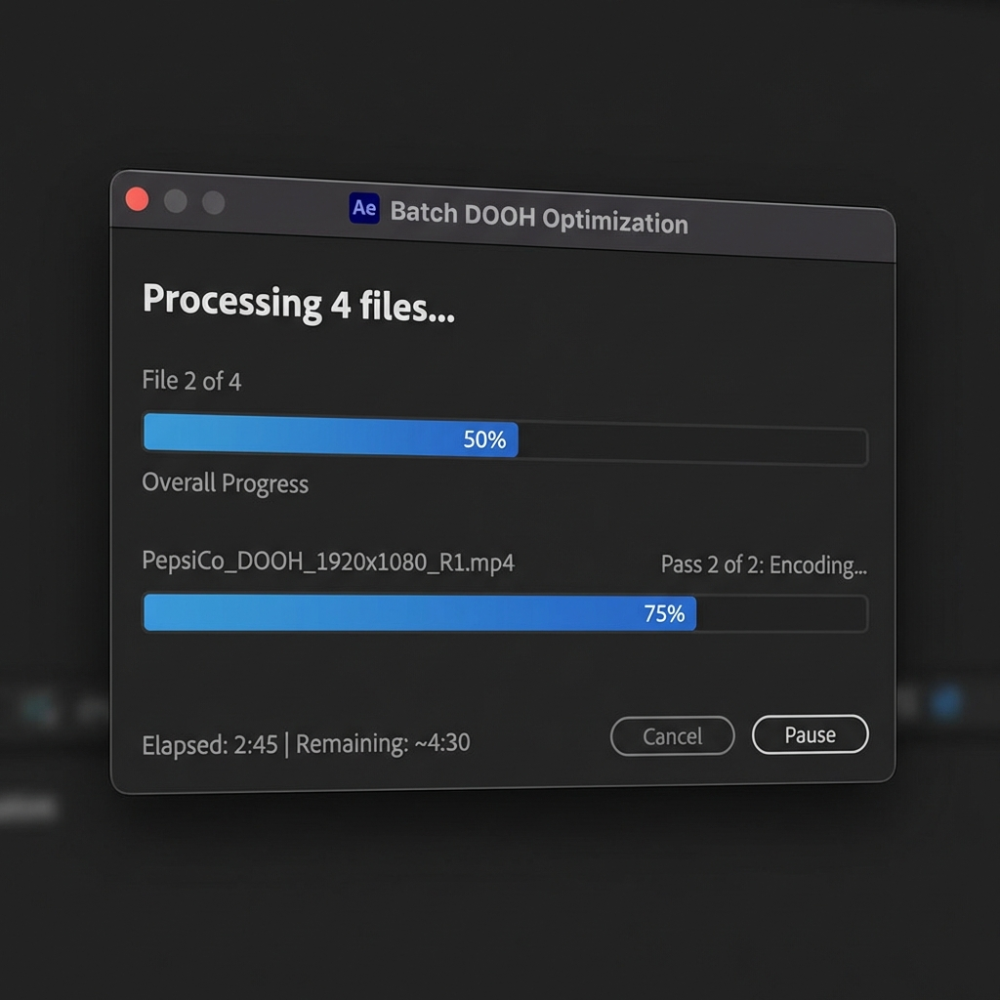
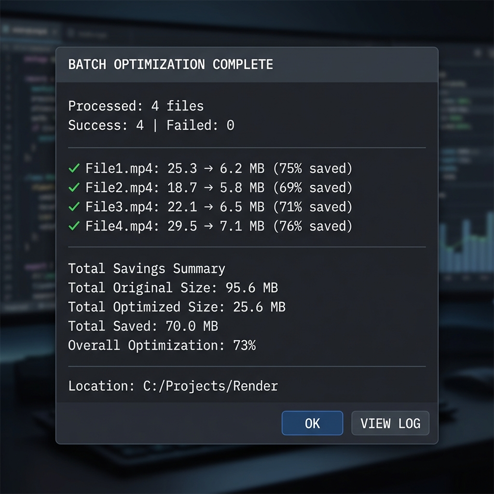

# Big Happy Launcher v1.0
## After Effects Template & DOOH Optimization Tool

**Created by Gourav Bhagat**

---

## Screenshots

### Main Panel

*The main interface with template selection, project details, and action buttons*

### Batch DOOH Optimization

*Real-time progress with elapsed time and estimated remaining time*

### Optimization Results

*Detailed results showing file sizes Savings percentage for each file*

---

## Quick Install

1. **Copy the script file** to:
   ```
   Windows: C:\Program Files\Adobe\Adobe After Effects [version]\Support Files\Scripts\ScriptUI Panels\
   Mac: /Applications/Adobe After Effects [version]/Scripts/ScriptUI Panels/
   ```

2. **Enable Script Access** in After Effects:
   - Edit > Preferences > Scripting & Expressions
   - ✅ "Allow Scripts to Write Files and Access Network"

3. **Restart After Effects** and find it under: `Window > BigHappyLauncher_Templates.jsx`

---

## Features

### 🎬 Template Management
- Create new projects with standardized naming
- Auto-generate folder structure (AE, Assets, Render)
- Support for Sunrise, Interscroller, and DOOH templates

### 📦 DOOH Optimization
Compress MP4 files to meet DOOH size requirements (< 7MB).

**Features:**
- Single file or **batch optimization**
- Real-time progress bar
- Enhanced results (file size, savings %, bitrate)
- Works without project open
- **Auto-installs FFmpeg** if not found

**How to use:**
1. Click **DOOH Optimize** button
2. Select MP4 file(s) - Ctrl+Click for multiple!
3. Enter duration (if no project open)
4. Wait for optimization

### 🔄 Post-Render Conversion
Convert PNG sequences to WebM/MOV with transparency.

---

## UI Reference

### Header Toolbar

| Button | Icon | Description |
|--------|------|-------------|
| **Open Project** | 📂 | Browse and open an existing `.aep` project file |
| **Import & Standardize** | 📥 | Import an external project and rename it to the standardized naming convention |
| **Recent Files** | 🕒 | View and quickly access recently opened projects |
| **Settings** | ⚙ | Open the Settings dialog to configure paths, FFmpeg, and preferences |

---

### Input Fields

#### Template Dropdown
Select from available templates (Sunrise, InterScroller, DOOH Horizontal, DOOH Vertical). Each template has predefined:
- **Dimensions** (Width × Height)
- **Frame Rate** (FPS)
- **Duration** (seconds)

#### Brand (Required)
Enter the client or brand name. This becomes part of the folder structure and filename.
- **Minimum:** 2 characters
- **Maximum:** 50 characters
- **Example:** `Coca-Cola`, `Nike`, `Apple`

#### Campaign
Enter the campaign or project name. Optional but recommended.
- **Maximum:** 50 characters
- **Example:** `Summer_Sale`, `Holiday_2026`, `Launch_Campaign`

---

### Time & Versioning Row

#### 📅 Quarter Dropdown
Select the quarter for organization (Q1, Q2, Q3, Q4). Auto-set to current quarter on launch.

#### 📅 Year Dropdown
Select the year for the project folder structure. Shows current year ±1.

#### 🏷️ Version (V)
Major version number for significant creative changes.
- **Example:** V1 → V2 when client requests major changes

#### 🏷️ Revision (R)
Minor revision number for small edits within a version.
- **Example:** R1 → R2 for small tweaks, R1 → R3 after feedback rounds

---

### Base Folder Row

#### 📂 Base Path
Shows the root folder where all projects are saved. Click **"..."** to:
- Open the folder if it exists
- Browse to select a new base folder

---

### Preview Section

| Label | Description |
|-------|-------------|
| **📂 Path** | Shows the full path where the project will be created |
| **📄 Filename** | Shows the standardized filename that will be generated |

---

### Action Buttons

#### CREATE PROJECT
Main action button. Creates a new project with:
- Standardized naming: `Brand_Campaign_WxH_V#_R#.aep`
- Folder structure: `Year/Quarter/Brand_Campaign/AE_File/`
- Asset folders: `Assets/Image/`, `Assets/Screen/`, etc.

#### Save As...
Save the current project as a copy with a new name or location.

#### R+ (Quick Revision)
**One-click revision increment.** Saves the current project as a new revision:
- Current: `Brand_Campaign_750x300_V1_R1.aep`
- After R+: `Brand_Campaign_750x300_V1_R2.aep`

#### V+ (Version Up)
**Increment version and reset revision.** For major changes:
- Current: `Brand_Campaign_750x300_V1_R3.aep`
- After V+: `Brand_Campaign_750x300_V2_R1.aep`

#### ☁ Collect
Collect all project assets and upload to Google Drive:
1. Removes unused footage
2. Collects all linked files
3. Creates organized folder structure
4. Uploads to configured Google Drive path

---

### Output Panel

#### ADD TO RENDER QUEUE
Adds the "Main" composition to After Effects Render Queue with appropriate output settings based on template type.

#### OPTIMIZE SUNRISE
Process Sunrise (750×300) renders:
- Converts PNG sequence to WebM (with transparency)
- Creates MOV (ProRes 4444)
- Generates HTML wrapper
- Creates ZIP bundle

#### OPTIMIZE DOOH (7MB)
Compress DOOH MP4 to meet strict 7MB size limit:
- Uses 2-pass FFmpeg encoding
- Supports batch optimization (select multiple files)
- Shows real-time progress
- Displays savings percentage

---

### Settings Dialog

Access via ⚙ button. Configure:

| Section | Options |
|---------|---------|
| **Paths** | Base Work Folder, Templates Folder, Google Drive Root |
| **Post-Render** | WebM output, MOV output, HTML generation, ZIP bundling |
| **FFmpeg** | Path to FFmpeg executable, Auto-install option |
| **DOOH** | Target size (default: 6.8MB for safety margin) |

---

## Requirements

- **After Effects CC 2019+**
- **FFmpeg** (auto-installed on first use, or manual setup)

---

## FFmpeg Setup

### Automatic (Recommended)
1. Click **DOOH Optimize**
2. Click **"⚡ Auto Install"**
3. Wait for download & setup (~1-2 min)

### Manual
1. Download from: https://ffmpeg.org/download.html
2. Extract to: `C:\ffmpeg`
3. In script: Settings ⚙ > Post-Render > Set Path to `C:\ffmpeg\bin\ffmpeg.exe`

---

## Keyboard Shortcuts

| Action | Shortcut |
|--------|----------|
| Run Unit Tests | Alt+Click on title |
| Run Stress Tests | Shift+Click on title |

---

## Troubleshooting

| Issue | Solution |
|-------|----------|
| "FFmpeg not found" | Auto-install or set path in Settings |
| "Path too long" error | Use shorter Brand/Campaign names |
| "Permission denied" | Enable script permissions in Preferences |
| Script won't load | Restart After Effects after copying |

---

## Version History

| Version | Changes |
|---------|---------|
| **v1.0** | Initial release with full feature set |
| | • Template management & standardized naming |
| | • DOOH batch optimization with progress |
| | • Auto FFmpeg download & setup |
| | • Post-render conversion (WebM/MOV) |
| | • Path length safety checks |
| | • Enhanced results with file savings |

---

## Author

**Gourav Bhagat**  
Big Happy Launcher © 2026

---

*Made with ❤️ for the animators*
