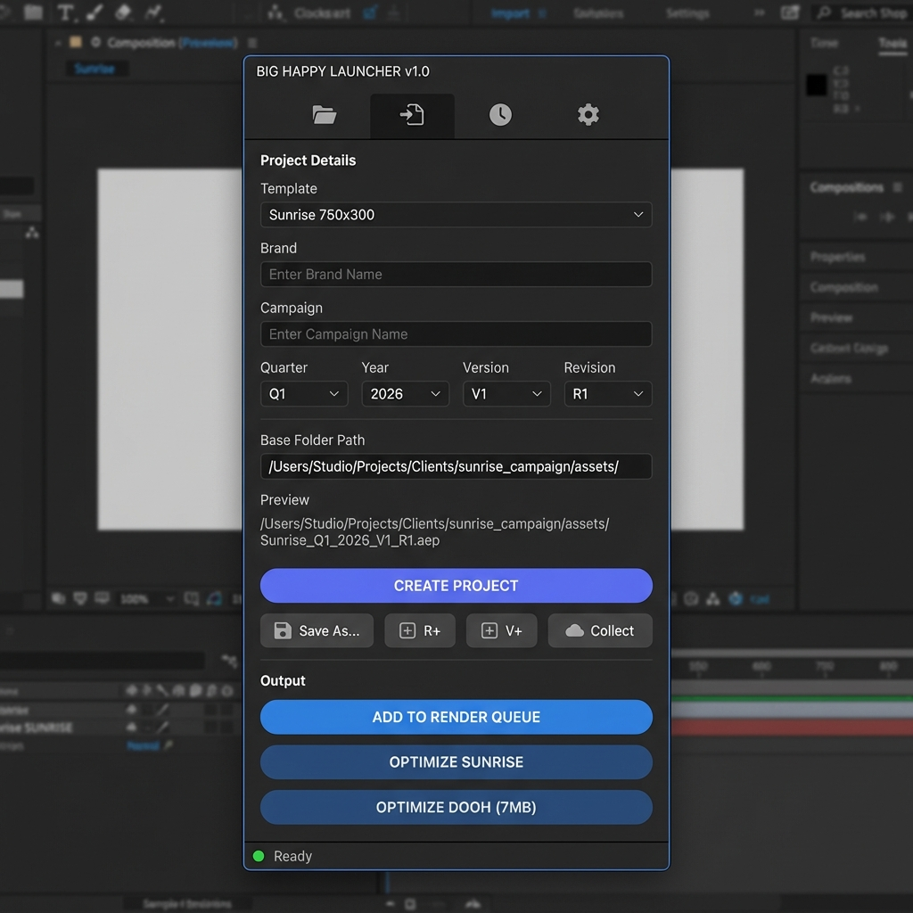
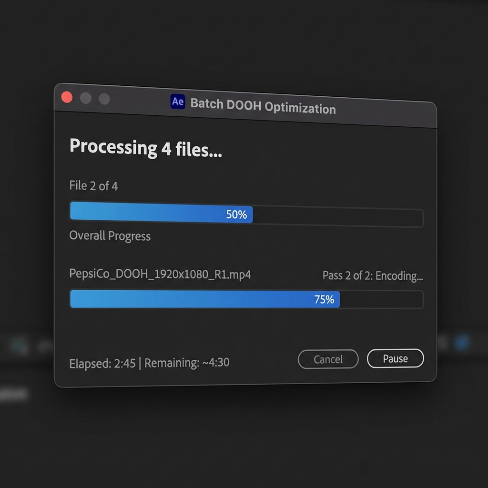
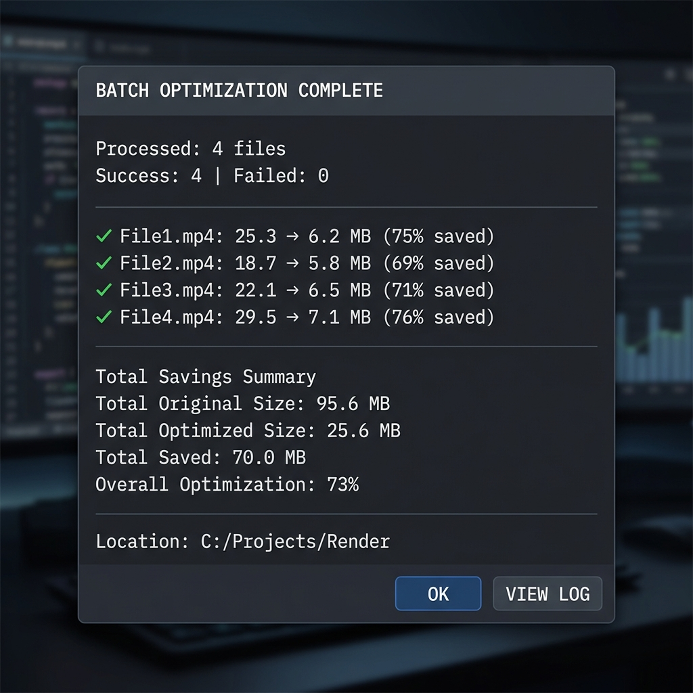

# Big Happy Launcher v1.0
## After Effects Template & DOOH Optimization Tool

**Created by Gourav Bhagat**

---

## What Does This Tool Do?

Big Happy Launcher is a comprehensive After Effects automation tool that streamlines your production workflow:

### Core Capabilities

🎯 **Template Project Creation**
- Creates standardized After Effects projects with proper naming conventions
- Auto-generates organized folder structures (AE files, Assets, Renders)
- Supports multiple template types: Sunrise (750×300), InterScroller, DOOH formats

📦 **DOOH Video Optimization**
- Batch compress MP4 files to meet strict 7MB DOOH size requirements
- CRF-constrained single-pass encoding with resolution-aware bitrate scaling
- Real-time progress tracking with elapsed time and ETA
- Detailed per-file results showing size savings and bitrate info
- Works standalone — no After Effects project needs to be open

🎬 **Post-Render Processing**
- Converts PNG sequences to WebM (with transparency support)
- Generates MOV files with ProRes 4444 codec
- Creates HTML preview wrappers
- Bundles everything into convenient ZIP files

⚡ **Smart Automation**
- Auto-detects and installs FFmpeg if missing (Windows & macOS)
- Displays installed FFmpeg version in Settings
- Version and revision management (V+ / R+ buttons)
- Asset collection and Google Drive upload integration
- Built-in path length safety checks

---

## Perfect For

✅ **Animators & Motion Designers** — Streamline project setup and asset management  
✅ **DOOH Advertisers** — Easily meet strict file size requirements for digital signage  
✅ **Production Studios** — Standardize naming conventions and folder structures  
✅ **Freelancers** — Manage versions and revisions with one-click buttons  
✅ **Teams** — Maintain consistent project organization across multiple people  

---

## Screenshots

### Main Panel

*The main interface with template selection, project details, and action buttons*

### Batch DOOH Optimization

*Real-time progress with elapsed time and estimated remaining time*

### Optimization Results

*Detailed results showing file sizes and savings percentage for each file*

---

## Quick Install

1. **Copy the script file** to:
   ```
   Windows: C:\Program Files\Adobe\Adobe After Effects [version]\Support Files\Scripts\ScriptUI Panels\
   Mac:     /Applications/Adobe After Effects [version]/Scripts/ScriptUI Panels/
   ```

2. **Enable Script Access** in After Effects:
   - Edit > Preferences > Scripting & Expressions
   - ✅ "Allow Scripts to Write Files and Access Network"

3. **Restart After Effects** and find it under: `Window > BigHappyLauncher_Templates.jsx`

---

## Features

### 🎬 Template Management
- Create new projects with standardized naming
- Auto-generate folder structure (AE, Assets, Render)
- Support for Sunrise, Interscroller, and DOOH templates
- Import & standardize external projects to match naming conventions
- Recent files panel with timestamps and quick-remove

### 📦 DOOH Optimization
Compress MP4 files to meet DOOH size requirements (< 7MB).

**Features:**
- Single file or **batch optimization**
- CRF 18 quality-constrained encoding with bitrate ceiling
- Resolution-aware bitrate scaling (1080p vs 4K vs portrait)
- Auto-detects video duration and resolution via FFprobe
- Real-time progress bar with per-file ETA
- Enhanced results: file size, savings %, bitrate info
- Works standalone (with or without a project open)
- **Auto-replaces original files** with the optimized ones (safely releases file locks held by the Render Queue or FootageItems, and automatically re-links them in the AE project)
- **Auto-installs FFmpeg** if not found (Windows & macOS)

**How to use:**
1. Click **OPTIMIZE DOOH (7MB)**
2. Select MP4 file(s) — Ctrl+Click for multiple
3. Confirm settings in the preview dialog
4. Wait for optimization — progress window closes automatically when done

### 🌅 Optimize Sunrise
Process Sunrise (750×300) post-render output:
- Converts PNG sequence to **WebM** (with transparency)
- Creates **MOV** (ProRes 4444)
- Generates **HTML** preview wrapper
- Creates **ZIP** bundle of all outputs

### 🔄 Version & Revision Management
- **R+** — Save as next revision (R1 → R2)
- **V+** — Increment version and reset revision (V1 R3 → V2 R1)
- Preview the new filename before saving

### ☁ Collect & Upload
- Removes unused footage from the project
- Collects all linked assets into a clean folder
- Groups AE files by template type
- Uploads to configured Google Drive path

---

## UI Reference

### Header Toolbar

| Button | Icon | Description |
|--------|------|-------------|
| **Open Project** | 📂 | Browse and open an existing `.aep` project file |
| **Import & Standardize** | 📥 | Import an external project and rename it to the standardized naming convention |
| **Recent Files** | 🕒 | View and quickly access recently opened projects |
| **Settings** | ⚙ | Configure paths, FFmpeg, post-render options, and DOOH target size |

---

### Input Fields

#### Template Dropdown
Select from available templates (Sunrise, InterScroller, DOOH Horizontal, DOOH Vertical). Each template has predefined:
- **Dimensions** (Width × Height)
- **Frame Rate** (FPS)
- **Duration** (seconds)

#### Brand (Required)
Enter the client or brand name. This becomes part of the folder structure and filename.
- **Minimum:** 2 characters
- **Maximum:** 50 characters
- **Example:** `Coca-Cola`, `Nike`, `Apple`

#### Campaign
Enter the campaign or project name. Optional but recommended.
- **Maximum:** 50 characters
- **Example:** `Summer_Sale`, `Holiday_2026`, `Launch_Campaign`

---

### Time & Versioning Row

| Control | Description |
|---------|-------------|
| **Quarter** | Q1–Q4 — auto-set to current quarter on launch |
| **Year** | Project year — shows current year ±1 |
| **V** | Major version number (increment for significant creative changes) |
| **R** | Minor revision number (increment for small edits) |

---

### Base Folder Row

#### 📂 Base Path
Shows the root folder where all projects are saved. Click **"..."** to open the folder or browse to a new one.

---

### Preview Section

| Label | Description |
|-------|-------------|
| **📂 Path** | Full path where the project will be created |
| **📄 Filename** | Standardized filename that will be generated |

---

### Action Buttons

#### CREATE PROJECT
Main action button. Creates a new project with:
- Standardized naming: `Brand_Campaign_WxH_V#_R#.aep`
- Folder structure: `Year/Quarter/Brand_Campaign/AE_File/`
- Asset folders: `Assets/Image/`, `Assets/Screen/`, etc.

#### Save As...
Save the current project as a copy with a new name or location.

#### R+ (Quick Revision)
One-click revision increment. Saves the current project as a new revision:
- Before: `Brand_Q2_750x300_V1_R1.aep`
- After: `Brand_Q2_750x300_V1_R2.aep`

#### V+ (Version Up)
Increment version and reset revision. For major changes:
- Before: `Brand_Q2_750x300_V1_R3.aep`
- After: `Brand_Q2_750x300_V2_R1.aep`

#### ☁ Collect
Collect all project assets and upload to Google Drive:
1. Removes unused footage
2. Collects all linked files
3. Creates organized folder structure grouped by template type
4. Uploads to configured Google Drive path

---

### Output Panel

#### ADD TO RENDER QUEUE
Adds the "Main" composition to After Effects Render Queue with appropriate output settings based on template type.

#### OPTIMIZE SUNRISE
Process Sunrise (750×300) renders into WebM, MOV, HTML, and ZIP.

#### OPTIMIZE DOOH (7MB)
Compress DOOH MP4(s) to meet the strict 7MB size limit. Supports single and batch mode.

---

### Settings Dialog

Access via the ⚙ button. Configure:

| Section | Options |
|---------|---------|
| **Paths** | Base Work Folder, Templates Folder, Google Drive Root |
| **Post-Render** | WebM output, MOV output, HTML generation, ZIP bundling |
| **FFmpeg** | Path to FFmpeg executable, installed version display, auto-install |
| **DOOH** | Target size (default: 6.8 MB for safety margin below 7 MB) |

---

## Requirements

- **After Effects CC 2019+**
- **FFmpeg** (auto-installed on first use, or configure manually in Settings)

---

## FFmpeg Setup

### Automatic (Recommended)
1. Click **OPTIMIZE DOOH (7MB)**
2. If FFmpeg is not found, click **"⚡ Auto Install"**
3. Wait for download and setup (~1–2 min)
4. The installed version will appear in Settings ⚙

### Manual
1. Download from [ffmpeg.org/download.html](https://ffmpeg.org/download.html)
2. Extract to `C:\ffmpeg` (Windows) or `/usr/local/bin` (Mac)
3. In the script: Settings ⚙ → set path to `C:\ffmpeg\bin\ffmpeg.exe`

---

## Keyboard Shortcuts

| Action | Shortcut |
|--------|----------|
| Create Project | Ctrl + Enter |
| Save As | Ctrl + S |

---

## Troubleshooting

| Issue | Solution |
|-------|----------|
| "FFmpeg not found" | Auto-install or set path in Settings ⚙ |
| Optimize window stays open after processing | Reload the script panel — changes require an AE restart |
| "Path too long" error | Use shorter Brand/Campaign names |
| "Permission denied" | Enable script permissions: Edit > Preferences > Scripting & Expressions |
| Script won't load | Restart After Effects after copying the file |
| Progress bar stuck during DOOH optimization | Processing is running — wait for the current file to finish encoding |

---

## Version History

| Version | Date | Changes |
|---------|------|---------|
| **v1.0** | May 2026 | Production stability release |
| | | • Fixed FFmpeg stdin hang (`-nostdin`) causing AE UI freeze during optimization |
| | | • Fixed palette progress windows not closing after processing (`w.hide()`) |
| | | • Fixed batch progress window re-appearing on cancel |
| | | • Auto-replace original videos with optimized version (re-linking any affected footage items in the project automatically) |
| | | • FFmpeg version display in Settings dialog |
| | | • Auto-install FFmpeg support on macOS |
| | | • DOOH encoding upgraded to CRF-constrained mode with resolution-aware bitrate |
| | | • 2-pass VBR option to guarantee 7MB limit while maximizing quality |
| | | • Auto-detect video duration and resolution via FFprobe |
| | | • Project status panel with "Ready" indicator |
| | | • Recent files panel with timestamps and remove button |
| | | • Path preview shown before R+/V+ saves |
| | | • Collect now groups AE files by template type |
| | | • Drive collect uses current quarter from UI (not filename) |
| | | • Fixed ReferenceError crash in `runMP4Optimizer` |
| | | • Fixed silent ScriptUI dialog errors (statictext → edittext) |
| | | • MOV fallback chain, zero-byte file checks, ZIP filtering |
| | | • Cross-platform compatibility (Windows & macOS) |
| **v1.0** | Feb 2026 | Initial production release |
| | | • Template management with standardized naming |
| | | • DOOH batch optimization with real-time progress |
| | | • Auto FFmpeg download & setup (Windows) |
| | | • Post-render conversion: WebM / MOV / HTML / ZIP |
| | | • Path length safety checks |
| | | • Version and revision management (V+ / R+) |

---

## Author

**Gourav Bhagat**  
Big Happy Launcher © 2026

---

*Made with ❤️ for the animators*
